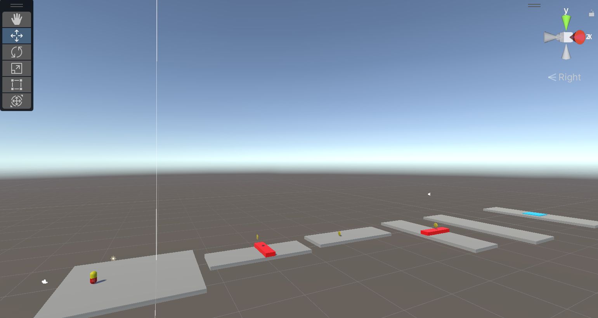
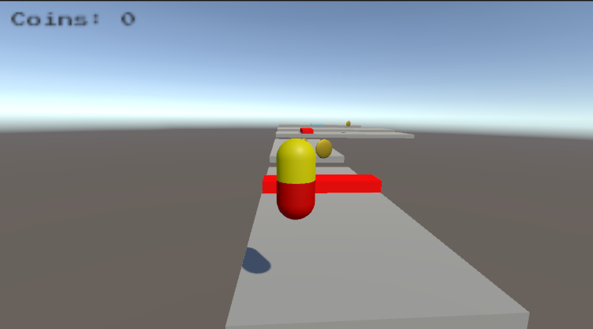

# super-capsule
This is a 3D game that allows user to collect coins, dodge enemies, and go to finish line.
Basically a 3D super Mario, but the player is a capsule.

This is a project for learning basic Unity 3D, the idea and code belong to the tutorial video on youtube.

I only changed some parts of level design and made a 3d model with blender. 

The game currently contains start scene, two levels and an end scene, I might add more levels one day.
# Features
- WASD to move, and space to jump
- Moving platform and enemy
- Two levels

# Details
- Game is made with Unity 3D
- 3D model is made with blender

# Results
## Level 1 Design

## Picture of Level (Jumping)

# Credits
- Music: Casual Game Music: [Happy, Bouncy, Social by Intersonic Sound on Unity Asset Store](https://assetstore.unity.com/packages/audio/music/electronic/casual-game-music-happy-bouncy-social-214104)

- Sound effects: [FREE Casual Game SFX Pack by DustyRoom on Unity Asset Store](https://assetstore.unity.com/packages/p/free-casual-game-sfx-pack-54116)

- Tutorial: [Build Your First 3D Game in Unity | Unity Beginner Tutorial by Coding in Flow (Youtube Playlist)](https://www.youtube.com/playlist?list=PLrnPJCHvNZuB5ATsJZLKX3AW4V9XaIV9b)